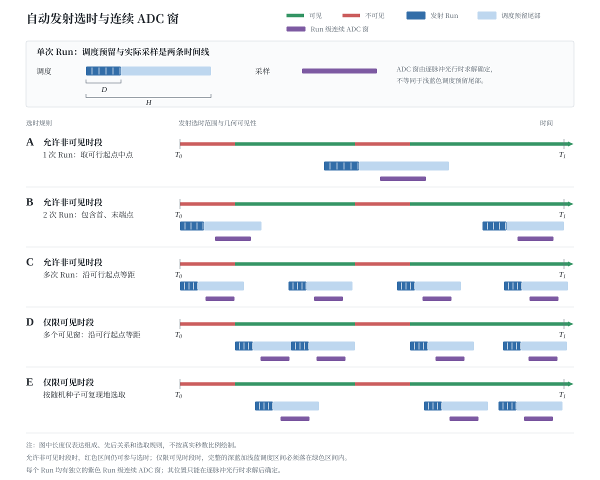

# 观测时刻选取与接收窗口生成

本文解释 Chirp 脉冲模式下程序如何从一段较大的时间范围中选出发射 Run，以及如何在发射时刻确定后计算回波到达时刻和 ADC 采样窗。相关实现位于 `observation/src/campaign_planning.py`、`observation/src/planning.py` 和 `observation/src/light_time.py`。

## 1. 从发射选时到 ADC 采样

程序按以下顺序工作：

1. 用户设置发射选时范围、Run 数量和单次 Run 时长。
2. 程序在整个发射选时范围内扫描几何可见性，得到一个或多个可见时段。
3. 程序计算一次 Run 需要的调度预留长度，并由此确定哪些时刻可以作为 Run 起点。
4. 程序按照等距或随机规则选出每个 Run 的发射开始时刻。
5. 程序按照 PRF 在每个 Run 内生成脉冲发射时刻。
6. 程序对每个脉冲求解“发射—目标散射—接收”三个事件的时刻。
7. 程序根据全部回波到达时刻、采集路径窗和脉冲宽度生成实际 ADC 采样窗。

前四步解决“什么时候安排发射任务”，后三步解决“发射后什么时候打开接收机以及采哪些点”。发射选时范围不是 ADC 窗，调度预留区间也不是 ADC 窗。

## 2. 术语

| 术语 | 配置或符号 | 含义 |
| --- | --- | --- |
| 发射选时范围 | `schedule.start_utc` 至 `schedule.end_utc` | 自动寻找 Run 起点的搜索范围，也是可见性扫描范围。 |
| 可见时段 | `visibility_windows` | 发射站和接收站均满足最低仰角要求的时间区间。 |
| 发射 Run | `tx_start_utc`、`tx_duration_s` | 一段连续的脉冲发射任务。Run 内按照 PRF 生成若干脉冲。 |
| Run 调度时长 | $D$ | `schedule.run_duration_s`，也是自动生成的 `tx_duration_s`。它是允许安排一列完整脉冲的时间区间，不等于射频连续开启时间。 |
| 调度预留长度 | $H$ | 单站自动选时为一次 Run 保守预留的总长度。它从 Run 开始时刻起算，覆盖实际发射及其后的传播、切换和接收余量。 |
| 调度预留尾部 | $H-D$ | 实际发射结束后暂不安排下一次单站 Run 的时间。传播、收发切换和接收可以在这段时间内彼此重叠。 |
| 质心参考回波时刻 | `receive_elapsed_s` | 由一个脉冲的发射前沿时刻正向求解得到的目标质心参考回波到达时刻。 |
| Run 级连续 ADC 窗 | `rx_adc_start_elapsed_s` 至 `rx_adc_stop_elapsed_s` | 一个 Run 共用的连续采样范围，从最早脉冲保存范围的左端延伸到最晚脉冲保存范围的右端。当前模型没有另设模拟接收机开机窗口。 |
| 脉冲保存行 | `row_start_sample`、`row_valid` | 从 Run 级全局 ADC 时间轴中为一个脉冲选出的固定宽度快时间视图。它不是一次新的硬件采样，也不会使接收机反复开关。 |

图中绿色和红色轴段分别表示几何可见与不可见时段；带白色脉冲纹理的深蓝色块表示 Run 调度区间，浅蓝色块表示调度预留尾部，二者合起来才是自动选时使用的一次完整调度预留区间。每个 Run 下方的紫色块表示根据实际回波到达时刻生成的 Run 级连续 ADC 窗；它的位置只能在逐脉冲光行时求解完成后确定，并不等同于调度预留尾部。示意图只表达组成、先后关系和选取规则，不按照真实秒数比例绘制。

## 3. 单次 Run 为什么需要调度预留

在单站收发切换模式中，同一部雷达不能同时发射和接收。一次 Run 发射完成后，雷达需要切换到接收状态，并等待最后一批回波完整返回。自动选时必须为这些过程保留空间，否则后一个 Run 的发射可能与前一个 Run 的接收发生冲突。

当前代码使用以下保守长度：

$$H=D+\tau_{\mathrm{path,max}}+T_{\mathrm{switch}}+T_{\mathrm{safety}}+T_{\mathrm{gate}}+T_{\mathrm{pulse}}.$$

| 符号 | 配置或计算来源 | 含义 |
| --- | --- | --- |
| $D$ | `schedule.run_duration_s` | Run 调度时长，用于限定一列完整脉冲可以占据的区间。 |
| $\tau_{\mathrm{path,max}}$ | 选时范围内估计的最大全路径长度除以光速 | 从发射站到目标再到接收站的最大传播时间。 |
| $T_{\mathrm{switch}}$ | `radar_system.switch_time_s` | 单站从发射状态切换到接收状态所需时间。 |
| $T_{\mathrm{safety}}$ | `radar_system.safety_margin_s` | 避免切换过程侵入最早回波的安全余量。 |
| $D_{\mathrm{extent}}$ | `target.extent_path_m` | 采集路径窗：相对质心参考路径，两侧各允许的最大额外双程路径。未知尺度和余量都写在这一个数里。 |
| $T_{\mathrm{gate}}$ | $D_{\mathrm{extent}}/c$ | 采集路径窗对应的时延。调度预留里它只加一次。 |
| $T_{\mathrm{pulse}}$ | `transmit.pulse_width_s` | 单个发射脉冲的持续时间。 |

这个公式是自动选时使用的保守上界，不是设备状态的精确时间线。电磁波传播时雷达可以同时进行收发切换，因此传播等待和切换并不一定首尾相接；程序只是把各项相加，给后续 Run 留出足够空间。真正的 ADC 开启和关闭时刻要到逐脉冲光行时求解完成后才能确定。

调度容量计算还有一个先决条件：在单站收发切换模式下，单次 Run 的最后一个实际脉冲必须在首个有效回波到达前完成，并留出切换时间和安全余量。程序按照 PRF 与脉冲宽度先计算 Run 内实际脉冲数及脉冲列跨度；若单次 Run 已违反该约束，则无论发射选时范围多长，Run 数量上限都为 0，不能再用“选时范围长度除以 $H$”得到一个表面上的正数容量。

双站连续接收模式使用相互独立的发射机和接收机，接收可以和后续发射并行，因此当前调度器只限制发射 Run 之间不能重叠，取 $H=D$。这不表示双站模式不接收回波。

## 4. 自动选取 Run 起点

### 4.1 构造候选时间区间

勾选“包含非可见时段”时，整个发射选时范围都是候选时间区间。未勾选时，只有几何可见时段可以成为候选区间。

候选区间还必须能够完整容纳长度为 $H$ 的调度预留区间。若某个候选区间为 $[a,b]$，则 Run 起点只能位于：

$$a\leq t_{\mathrm{run}}\leq b-H.$$

因此，可见时段长度小于 $H$ 时，该时段无法容纳一次 Run，会被排除。这里检查的是完整的“实际发射加调度预留尾部”，不能只让深蓝色发射部分落入可见时段。

### 4.2 非随机选取

只有一次 Run 时，程序取全部可行起点区间累计长度的中点。两次或更多 Run 时，程序在累计可行起点长度上等距取点，并包含首端和末端。

当只有一个连续候选区间时，这等价于在 $[a,b-H]$ 上取中点或等距点。当存在多个离散可见时段时，程序先把每段的可行起点区间按长度首尾拼接，再在拼接后的累计长度上等距取点，最后映射回各自的绝对时刻。因此这里等距的是“可行起点累计长度”，不一定是绝对 UTC 时间间隔。

如果等距结果会使两个长度为 $H$ 的预留区间互相重叠，程序改用离散的不重叠槽位。可行槽位不足时，自动选时失败并报错。

### 4.3 随机选取

随机模式先在每个候选区间内构造能够容纳长度 $H$ 的不重叠槽位，再从全部槽位中无放回抽取指定数量，最后利用候选区间中的剩余松弛长度加入随机偏移。相同随机种子会得到相同结果。随机只改变 Run 在可行范围内的位置，不会放宽可见性、完整容纳和互不重叠约束。

## 5. 示例：`configs/chirp_point_target_test.json`

这个例子使用静止目标和单站收发切换模式。发射站与接收站都位于坐标原点，目标位于 $(c,0,0)\,\mathrm{m}$，因此单程传播时间为 1 s，双程传播时间为 2 s。目标和测站均静止，所以路径变化率为 0，不需要对持续时间进行多普勒伸缩。

### 5.1 已知参数

| 物理量 | 配置值 |
| --- | ---: |
| 发射选时范围长度 $W$ | $5\,\mathrm{s}$ |
| Run 数量 | 1 |
| Run 调度时长 $D$ | $0.4\,\mathrm{s}$ |
| 双程传播时间 $\tau_{\mathrm{path,max}}$ | $2.0\,\mathrm{s}$ |
| 收发切换时间 $T_{\mathrm{switch}}$ | $0.2\,\mathrm{s}$ |
| 安全余量 $T_{\mathrm{safety}}$ | $0.2\,\mathrm{s}$ |
| 采集路径窗 $D_{\mathrm{extent}}$ | $0\,\mathrm{m}$ |
| 门时延 $T_{\mathrm{gate}}=D_{\mathrm{extent}}/c$ | $0\,\mathrm{s}$ |
| 脉冲宽度 $T_{\mathrm{pulse}}$ | $0.01\,\mathrm{s}$ |

该配置允许包含非可见时段，所以完整的 5 s 发射选时范围都作为候选区间。测站位于坐标原点，无法定义本地地平坐标系，几何可见性本身不能计算；允许非可见时段使这个纯算法仿真实例仍能继续选时。

配置中的 `selection=equal_visible_time` 表示非随机自动选取。此时程序根据 `run_count` 和 `run_duration_s` 重新生成 Run；若 JSON 里仍残留手动 `schedule.runs` 或 `random_seed`，规范化会直接报错，而不是静默忽略。自动选取还需要明确的选时窗口右端：`schedule.end_utc` 缺失时程序直接报错，不会退回按残留 `runs` 推算（那会让窗口静默塌成 1 秒）。

### 5.2 计算调度预留长度

先按照符号含义代入：

$$\begin{aligned}H={}&D+\tau_{\mathrm{path,max}}+T_{\mathrm{switch}}+T_{\mathrm{safety}}+T_{\mathrm{gate}}+T_{\mathrm{pulse}}\\={}&0.4+2.0+0.2+0.2+0+0.01\\={}&2.81\,\mathrm{s}.\end{aligned}$$

这意味着一次 Run 可以在 0.4 s 的调度区间内安排脉冲，自动选时则从 Run 开始时刻起保留 2.81 s，避免在回波尚未完整接收时安排下一次单站发射。

### 5.3 计算 Run 开始时刻

发射选时范围为 $[0,5]$ s。为了让长度为 2.81 s 的完整预留区间不越过右端点，Run 起点的可行范围是：

$$0\leq t_{\mathrm{run}}\leq W-H=5-2.81=2.19\,\mathrm{s}.$$

只有一次非随机 Run，因此取可行起点区间中点：

$$t_{\mathrm{run}}=\frac{0+2.19}{2}=1.095\,\mathrm{s}.$$

发射选时范围从 `2026-09-11T09:30:00Z` 开始，所以 Run 从 `2026-09-11T09:30:01.095000Z` 开始。调度上保留的区间是相对时刻 $[1.095,3.905]$ s，其中前 0.4 s 是发射 Run，其余部分是传播、切换和接收的保守余量。

### 5.4 生成脉冲和 ADC 窗

PRF 为 20 Hz，脉冲重复周期为：

$$T_{\mathrm{PRT}}=\frac{1}{20}=0.05\,\mathrm{s}.$$

脉冲宽度为 0.01 s。程序只生成能够完整放入 0.4 s Run 的脉冲，脉冲数按下式计算：

$$N=\left\lfloor\left(D-T_{\mathrm{pulse}}\right)\mathrm{PRF}\right\rfloor+1=\lfloor(0.4-0.01)\times20\rfloor+1=8.$$

8 个脉冲的发射前沿为 `1.095, 1.145, ..., 1.445 s`。最后一个脉冲从 1.445 s 发射到 1.455 s，完整发射结束；Run 调度区间到 1.495 s 才结束，因此末尾剩余 0.04 s 空闲。下一个脉冲若在 1.495 s 开始，将到 1.505 s 才结束，已经越过 Run 边界，所以程序不生成它。这里不存在脉冲中断。

这三个时间量应当区分：Run 调度时长是 $D=0.4\,\mathrm{s}$；从第一个脉冲开始到最后一个脉冲结束的脉冲列跨度是 $(N-1)T_{\mathrm{PRT}}+T_{\mathrm{pulse}}=0.36\,\mathrm{s}$；发射机真正输出射频信号的累计开启时间是 $NT_{\mathrm{pulse}}=0.08\,\mathrm{s}$。其余时间是脉冲间隔和 Run 尾部不足以容纳下一完整脉冲的余量。

每个脉冲经过 1 s 到达目标，再经过 1 s 返回接收站，所以质心参考回波依次在 `3.095, 3.145, ..., 3.445 s` 到达。采集路径窗为 0。前沿和后沿都先加半个采样再向上取整，所以左侧仍留 1 个样点，右侧是脉冲宽度 0.01 s 再加这半个采样。随后取所有脉冲保存行的并集外包络，形成一个 Run 共用的连续 ADC 窗。因此整个 Run 的 ADC 窗为：

$$t_{\mathrm{ADC,on}}=3.095-\frac{1}{5000}=3.0948\,\mathrm{s},$$

$$t_{\mathrm{ADC,off}}=3.0948+\frac{1803}{5000}=3.4554\,\mathrm{s}.$$

窗尾由保存行的整数网格决定：最后一行起点索引为 1750，末格索引为 $1750+53-1=1802$，取 $Q=1803$ 使半开窗 $[0,1803)$ 覆盖该末格。物理尾沿是最后一发质心回波再加脉宽，$3.445+0.01=3.455\,\mathrm{s}$。末格时刻 $3.0948+1802/5000=3.4552\,\mathrm{s}$，不早于这个尾沿。多出来的 0.0002 s 就是半个采样补偿向上取整后的那一列。

### 5.5 本例为什么没有保存行重叠

采样率为 5000 Hz，一个 ADC 样点间隔为 $0.0002\,\mathrm{s}$。采集路径窗为 0，所以

$$n_{\mathrm{pre}}=\lceil T_{\mathrm{gate}}f_s+0.5\rceil=\lceil 0.5\rceil=1.$$

脉冲宽度 0.01 s 对应 50 个采样间隔。后置格数再加 0.5 点后向上取整（理由见 §5.6）：

$$n_{\mathrm{after}}=\lceil 0.01\times 5000+0.5\rceil=51.$$

加上质心所在的那一列：

$$N_{\mathrm{fast}}=1+51+1=53.$$

相邻脉冲相隔 0.05 s，即 250 个 ADC 索引。53 小于 250，相邻保存行不共享全局索引，因此 `window_overlap` 为假。脉冲宽度 0.01 s 也小于 0.05 s 的脉冲间隔，有效回波支撑不相交，`signal_echo_overlap` 同样为假。

保存行变宽以后这两件事会分开。路径窗把有效回波支撑向质心两侧拉开，支撑长度超过脉冲间隔时，`signal_echo_overlap` 为真，回波生成器必须把相关脉冲叠加。即便物理支撑还没碰上，半采样补偿仍可能让行宽比脉冲间隔多出 1 列，此时只有 `window_overlap` 为真：二维行共享边界样点，物理回波并没有重叠。当前 `echo/src/echo.py` 先按唯一全局 ADC 索引求和，再映射回保存行，两种重叠都能写入；这条警告说明旧版逐行生成器不能消费共享索引的计划。

### 5.6 后置格数的 0.5 点栅格补偿

记静止时标下的后沿需求为 $T_{\mathrm{after}}=T_{\mathrm{pulse}}+T_{\mathrm{gate}}$。后置格数按

$$n_{\mathrm{pre}}=\left\lceil T_{\mathrm{before}}f_s+0.5\right\rceil,\qquad n_{\mathrm{after}}=\left\lceil T_{\mathrm{after}}f_s+0.5\right\rceil$$

计算。行的两端都相对舍入后的质心量格数，而质心在采样栅格上带有由 $\mathrm{rint}$ 产生的最多半个采样的残差。只做 $\lceil T f_s\rceil$ 时，质心被舍入到更晚的网格点会让首格晚于路径窗前沿，被舍入到更早的网格点会让末格早于路径窗尾沿。两侧都加上 0.5 点后，首格不晚于前沿，末格不早于尾沿。代价是每一侧最多增加 1 列。本例 $T_{\mathrm{before}}=0$、$T_{\mathrm{after}}f_s=50$，补偿后 $n_{\mathrm{pre}}=1$、$n_{\mathrm{after}}=51$，故 $N_{\mathrm{fast}}=53$。行宽多出的列会把“行宽恰好等于脉冲间隔”的配置标成 `window_overlap`。

## 6. 从发射时刻求解回波时刻

对每个脉冲，程序先固定发射前沿时刻，再迭代求解电磁波到达运动目标的散射时刻；随后固定散射时刻，再迭代求解回波到达运动接收站的时刻。两段共同构成“发射—散射—接收”三事件几何。

单站模式还会检查最后一次发射结束后的切换是否足够快。设最早有效回波开始时刻为 $t_{\mathrm{echo,earliest}}$，必须满足：

$$t_{\mathrm{tx,end}}+T_{\mathrm{switch}}+T_{\mathrm{safety}}<t_{\mathrm{echo,earliest}}.$$

如果该条件不成立，发射、切换和安全余量已经侵入最早回波，程序直接报错，不会把 ADC 窗向后移动并悄悄丢弃信号。

## 7. 连续 ADC 窗与脉冲保存行

当前实现包含一个物理采样层和一个数据组织层。物理采样层是每个 Run 的一条连续 ADC 时间轴；数据组织层把连续时间轴切成每脉冲一行的二维 `[pulse, fast_time]` 数组。多行可以引用同一个全局 ADC 样点，但该样点在物理层只存在一次。

目标质心只给出参考回波时刻。采集路径窗 `target.extent_path_m` 是相对这条参考路径、两侧各允许的最大额外双程路径。未知形体、星历误差和希望多留的余量都进这一个数。它对应的时延是 $T_{\mathrm{gate}}=D_{\mathrm{extent}}/c$。脉冲从前沿开始持续 `pulse_width_s`，因此脉冲宽度只加在参考时刻后侧。

考虑路径变化导致的时标伸缩后，第 $i$ 个脉冲需要覆盖的前后范围为：

$$T_{\mathrm{before},i}=\frac{D_{\mathrm{extent}}}{c}S_i,$$

$$T_{\mathrm{after},i}=\left(T_{\mathrm{pulse}}+\frac{D_{\mathrm{extent}}}{c}\right)S_i.$$

程序取 $n_{\mathrm{pre}}=\lceil\max_i(T_{\mathrm{before},i})f_s+0.5\rceil$，再以本 Run 的首个质心接收事件为整数网格锚点，把连续 ADC 窗开启时刻设为该事件之前 $n_{\mathrm{pre}}$ 个采样周期。因为 $n_{\mathrm{pre}}/f_s\geq\max_i(T_{\mathrm{before},i})$ 且同一 Run 的接收事件严格递增，这个起点能够覆盖所有脉冲的最早回波，同时保证第一条保存行从全局 ADC 索引 0 开始。关闭时刻由保存行整数网格给出：末格不早于最晚的 $T_{\mathrm{after}}$。路径窗只计入一次；所有保存行的外包络就是 Run 级连续 ADC 窗。物理上接收机不会按二维行反复开关。

有效回波范围、脉冲保存行和 Run 级连续 ADC 窗是三个不同概念。有效回波范围是脉宽、路径窗和时标伸缩决定的物理支撑，不含单独的时间保护。脉冲保存行是从全局 ADC 轴上切出的固定宽度快时间视图。Run 级连续 ADC 窗是这些保存行的时间外包络。

以 `configs/chirp_mesh_target_test.json` 的静止时标为例：$D_{\mathrm{extent}}=1000\,\mathrm{m}$，$c=299792458\,\mathrm{m/s}$，所以

$$T_{\mathrm{gate}}=\frac{1000}{c}=3.335641\,\mu\mathrm{s}.$$

快时间采样率 $f_s=200\,\mathrm{MHz}$，于是

$$n_{\mathrm{pre}}=\lceil T_{\mathrm{gate}}f_s+0.5\rceil=\lceil 667.628\rceil=668.$$

质心参考回波落在第 668 号样点，行内时刻为 $668/f_s=3.340\,\mu\mathrm{s}$。计划允许的最早回波在质心之前 $T_{\mathrm{gate}}$，行内时刻为 $3.340\,\mu\mathrm{s}-3.335641\,\mu\mathrm{s}=4.359\,\mathrm{ns}$，介于第 0 号样点与第 1 号样点之间。

椭球网格的外接半径是 $70\,\mathrm{m}$。单站时沿 $\mathbf u_{\mathrm{tx}}+\mathbf u_{\mathrm{rx}}$ 的投影上界是 $2\times 70=140\,\mathrm{m}$，时延 $140/c=0.467\,\mu\mathrm{s}$。这个最早面元回波的行内时刻约为 $3.340\,\mu\mathrm{s}-0.467\,\mu\mathrm{s}=2.873\,\mu\mathrm{s}$，落在第 574 号与第 575 号样点之间。$1\,\mathrm{km}$ 的采集路径窗比这 $140\,\mathrm{m}$ 的形体路径宽，多出来的是未知尺度和余量，不是目标的显示直径。若实际差分路径超过 $D_{\mathrm{extent}}$，回波生成器直接报错，不会悄悄截断。

## 8. 路径变化率与多普勒时标伸缩

设双基地总传播路径为 $L=R_{\mathrm{tx}}+R_{\mathrm{rx}}$，传播时延为 $L/c$。发射时刻和接收时刻局部满足：

$$t_{\mathrm r}=t_{\mathrm e}+\frac{L(t_{\mathrm r})}{c}.$$

对时间求导可得：

$$dt_{\mathrm e}=\left(1-\frac{1}{c}\frac{dL}{dt_{\mathrm r}}\right)dt_{\mathrm r}.$$

定义总路径相对接收时刻的变化率：

$$v_L=\frac{dL}{dt_{\mathrm r}},$$

则发射端持续时间和接收端持续时间之间的局部关系为：

$$dt_{\mathrm r}=\frac{dt_{\mathrm e}}{1-v_L/c}.$$

当总路径增长时 $v_L>0$，目标整体表现为远离，接收时间轴被拉长；总路径缩短时 $v_L<0$，接收时间轴被压缩。这与载波多普勒频移来自同一个传播时延变化机制。代码在每个脉冲发射时刻两侧取 $\pm0.01\,\mathrm{s}$，分别重新求解完整三事件几何，再用中心差分估计 $v_L$。

ADC 规划的目标是避免截断，因此只在需要时扩大覆盖范围，不因路径缩短主动减小采集路径窗：

$$S_i=\max\left(1,\frac{1}{1-v_{L,i}/c}\right).$$

例如 $v_L=30\,\mathrm{km/s}$ 时，$S\approx1.00010001$，一个 1 ms 脉冲在接收时间轴上大约增加 $0.1\,\mu\mathrm{s}$。真正的回波生成仍使用带符号的实际局部时标映射，因此回波本身既可能拉伸，也可能压缩。

## 9. 可见性采样与星历查询步长

`visibility.sample_step_s` 是可见性扫描步长。程序在整个发射选时范围内按该步长计算发射端和接收端的仰角，再用相邻可见性采样点的中点近似可见窗口边界。当前实现即使面对稀疏可见时段也会扫描整个范围，没有采用粗扫后局部细化算法。一个月范围使用 30 s 步长约产生 8.64 万个采样点。

`ephemeris.query_step_s` 是 Horizons 状态表的查询间隔。程序先取得覆盖所需时间范围的星历表，再在本地对光行时求解所需的具体时刻进行线性插值。它与可见性采样步长控制不同的计算过程，不能互相替代。

GUI 仅在目标“位置来源”选择“Horizons 星历”时显示 `ephemeris.query_step_s`。该字段位于观测解算阶段的“几何求解”卡片中，界面名称为“星历步长”。手动坐标目标不查询 Horizons，因此该卡片会隐藏。

## 10. 几何求解中的内部参数

旧版 GUI 曾经公开光行时固定点迭代参数 `solver.tolerance_s`、`solver.max_iter`，以及 Horizons 查询策略参数 `ephemeris.padding_s`、`query_mode`、`query_chunk_size`、`min_query_chunk_size` 和 `query_retries`。当前 schema v4 已删除这些公开配置项，配置文件继续携带它们会被校验器拒绝。

光行时迭代本身仍然存在。`observation/src/light_time.py` 当前使用 $10^{-9}\,\mathrm{s}$ 的内部收敛阈值和 32 次最大迭代次数，分别求解发射到散射、散射到接收两个传播段。达到阈值便停止；超过最大次数仍未收敛则报错；迭代次数接近上限时输出警告。$10^{-9}\,\mathrm{s}$ 对应约 0.30 m 的单程光程尺度，但最终几何精度还受到输入星历、插值步长和坐标模型限制。

Horizons 查询余量、请求模式、分块和重试也转为内部策略。仍然直接影响科学计算时间网格的 `ephemeris.query_step_s` 被保留为用户配置项，所以当前几何求解卡片只显示“星历步长”。
